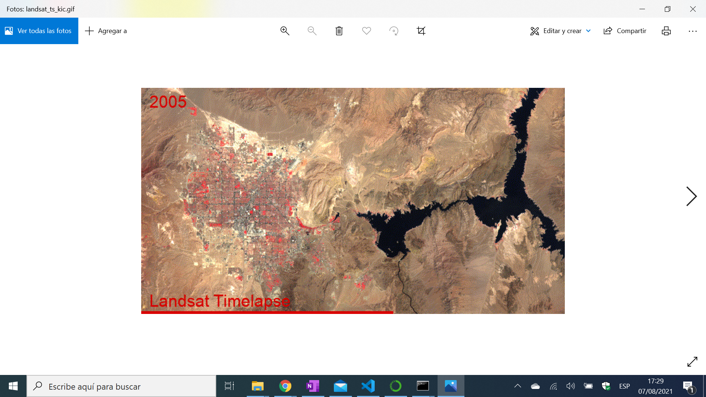

# Python Anaconda Geemap

* Anaconda virtual environment used with Jupyter Notebook to launch an example Geemap repo and view Google Earth Engine data
* Tutorial from [burdGIS](https://www.youtube.com/channel/UCABPfMswe_-Ywrj5pHiRUoA) - see [:clap: Inspiration](#clap-inspiration) below
* **Note:** to open web links in a new window use: _ctrl+click on link_

## :page_facing_up: Table of contents

* [:zap: Python Anaconda Geemap](#zap-python-anaconda-geemap)
  * [:page_facing_up: Table of contents](#page_facing_up-table-of-contents)
  * [:books: General info](#books-general-info)
  * [:camera: Screenshots](#camera-screenshots)
  * [:signal_strength: Technologies](#signal_strength-technologies)
  * [:floppy_disk: Setup](#floppy_disk-setup)
  * [:flashlight: Testing](#flashlight-testing)
  * [:computer: Code Examples](#computer-code-examples)
  * [:cool: Features](#cool-features)
  * [:clipboard: Status & To-Do List](#clipboard-status--to-do-list)
  * [:clap: Inspiration](#clap-inspiration)
  * [:file_folder: License](#file_folder-license)
  * [:envelope: Contact](#envelope-contact)

## :books: General info

* You have to apply for access to use Google Earth Engine and they will give you an access key
* [Geemap Landsat Timelapse](https://github.com/giswqs/geemap/blob/master/examples/notebooks/39_timelapse.ipynb) example Jupyter Notebook code used

## :camera: Screenshots

## :signal_strength: Technologies

* [Anaconda Individual Edition](https://www.anaconda.com/) data science platform
* [Jupyter Notebook](https://jupyter.org/) installed with [conda](https://docs.conda.io/en/latest/) package management system
* [Geemap](https://github.com/giswqs/geemap) Python package for interactive mapping with Google Earth Engine, ipyleaflet, and ipywidgets.
* [Google Earth Engine](https://earthengine.google.com/) planetary-scale platform for Earth science data & analysis

## :floppy_disk: Setup

* see Tutorial. Everything installed OK on Windows 10 Home Edition

## :flashlight: Testing

* N/A

## :computer: Code Examples

* N/A

## :cool: Features

* Time lapse geo data displayed on map

## :clipboard: Status & To-Do List
* Working
* To-Do: Nothing

## :clap: Inspiration

* [burdGIS: Python, Anaconda, Google Earth Engine & geemap | burdGIS](https://www.youtube.com/watch?v=H6MpxlMbjeY)

## :file_folder: License

* N/A

## :envelope: Contact

* Repo created by [ABateman](https://github.com/AndrewJBateman), email: gomezbateman@yahoo.com
